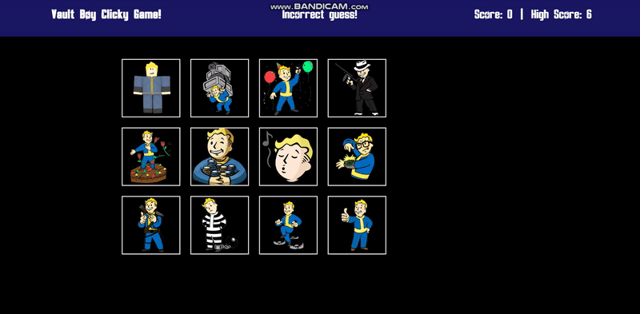

# clicky_game
* The purpose of this game is to achieve the hightest score possible by avoiding clicking characters two times. After each click user makes, the image will be rearranged in a new order to disrupt users achieving high score.

## Demonstration

## Dependencies

* Best viewed/played laptop or desktop

## Deployed Page:
* https://hyeonguw.github.io/clicky_game_2/

## Authors

* Hyeong Suk Kim - whddkf2004@gmail.com

## Technologies used in the App
* npm
* React
* JavaScript
* HTML, CSS

## Copyright
* Copyright of Character appears in the game belongs to Bethesda Softworks

## Version History
* 0.1  Initial Release